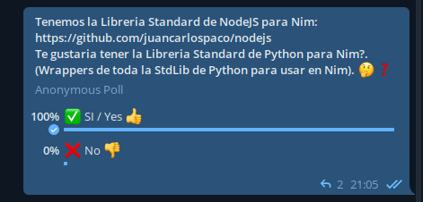

# Alternative StdLib for Nim for Python targets


# Documentation

- :heavy_check_mark: [atexit](https://docs.python.org/3.10/library/atexit) :arrow_right: https://juancarlospaco.github.io/cpython/atexit
- :heavy_check_mark: [base64](https://docs.python.org/3.10/library/base64) :arrow_right: https://juancarlospaco.github.io/cpython/base64
- :heavy_check_mark: [binascii](https://docs.python.org/3.10/library/binascii) :arrow_right: https://juancarlospaco.github.io/cpython/binascii
- :heavy_check_mark: [binhex](https://docs.python.org/3.10/library/binhex) :arrow_right: https://juancarlospaco.github.io/cpython/binhex
- :heavy_check_mark: [builtins](https://docs.python.org/3.10/library/builtins) :arrow_right: https://juancarlospaco.github.io/cpython/builtins
- :heavy_check_mark: [bz2](https://docs.python.org/3.10/library/bz2) :arrow_right: https://juancarlospaco.github.io/cpython/bz2
- :heavy_check_mark: [cmath](https://docs.python.org/3.10/library/cmath) :arrow_right: https://juancarlospaco.github.io/cpython/cmath
- :heavy_check_mark: [codecs](https://docs.python.org/3.10/library/codecs) :arrow_right: https://juancarlospaco.github.io/cpython/codecs
- :heavy_check_mark: [codeop](https://docs.python.org/3.10/library/codeop) :arrow_right: https://juancarlospaco.github.io/cpython/codeop
- :heavy_check_mark: [colorsys](https://docs.python.org/3.10/library/colorsys) :arrow_right: https://juancarlospaco.github.io/cpython/colorsys
- :heavy_check_mark: [compileall](https://docs.python.org/3.10/library/compileall) :arrow_right: https://juancarlospaco.github.io/cpython/compileall
- :heavy_check_mark: [copy](https://docs.python.org/3.10/library/copy) :arrow_right: https://juancarlospaco.github.io/cpython/copy
- :heavy_check_mark: [crypt](https://docs.python.org/3.10/library/crypt) :arrow_right: https://juancarlospaco.github.io/cpython/crypt
- :heavy_check_mark: [curses](https://docs.python.org/3.10/library/curses) :arrow_right: https://juancarlospaco.github.io/cpython/curses
- :heavy_check_mark: [decimal](https://docs.python.org/3.10/library/decimal) :arrow_right: https://juancarlospaco.github.io/cpython/decimal
- :heavy_check_mark: [dbd](https://docs.python.org/3.10/library/dbd) :arrow_right: https://juancarlospaco.github.io/cpython/dbd
- :heavy_check_mark: [dis](https://docs.python.org/3.10/library/dis) :arrow_right: https://juancarlospaco.github.io/cpython/dis
- :heavy_check_mark: [doctest](https://docs.python.org/3.10/library/doctest) :arrow_right: https://juancarlospaco.github.io/cpython/doctest
- :heavy_check_mark: [ensurepip](https://docs.python.org/3.10/library/ensurepip) :arrow_right: https://juancarlospaco.github.io/cpython/ensurepip
- :heavy_check_mark: [errno](https://docs.python.org/3.10/library/errno) :arrow_right: https://juancarlospaco.github.io/cpython/errno
- :heavy_check_mark: [faulthandler](https://docs.python.org/3.10/library/faulthandler) :arrow_right: https://juancarlospaco.github.io/cpython/faulthandler
- :heavy_check_mark: [fcntl](https://docs.python.org/3.10/library/fcntl) :arrow_right: https://juancarlospaco.github.io/cpython/fcntl
- :heavy_check_mark: [filecmp](https://docs.python.org/3.10/library/filecmp) :arrow_right: https://juancarlospaco.github.io/cpython/filecmp
- :heavy_check_mark: [fnmatch](https://docs.python.org/3.10/library/fnmatch) :arrow_right: https://juancarlospaco.github.io/cpython/fnmatch
- :heavy_check_mark: [gc](https://docs.python.org/3.10/library/gc) :arrow_right: https://juancarlospaco.github.io/cpython/gc
- :heavy_check_mark: [getopt](https://docs.python.org/3.10/library/getopt) :arrow_right: https://juancarlospaco.github.io/cpython/getopt
- :heavy_check_mark: [getpass](https://docs.python.org/3.10/library/getpass) :arrow_right: https://juancarlospaco.github.io/cpython/getpass
- :heavy_check_mark: [gettext](https://docs.python.org/3.10/library/gettext) :arrow_right: https://juancarlospaco.github.io/cpython/gettext
- :heavy_check_mark: [glob](https://docs.python.org/3.10/library/glob) :arrow_right: https://juancarlospaco.github.io/cpython/glob
- :heavy_check_mark: [grp](https://docs.python.org/3.10/library/grp) :arrow_right: https://juancarlospaco.github.io/cpython/grp
- :heavy_check_mark: [gzip](https://docs.python.org/3.10/library/gzip) :arrow_right: https://juancarlospaco.github.io/cpython/gzip
- :heavy_check_mark: [hashlib](https://docs.python.org/3.10/library/hashlib) :arrow_right: https://juancarlospaco.github.io/cpython/hashlib
- :heavy_check_mark: [hmac](https://docs.python.org/3.10/library/hmac) :arrow_right: https://juancarlospaco.github.io/cpython/hmac
- :heavy_check_mark: [html.entities](https://docs.python.org/3.10/library/html.entities) :arrow_right: https://juancarlospaco.github.io/cpython/html_entities
- :heavy_check_mark: [imghdr](https://docs.python.org/3.10/library/imghdr) :arrow_right: https://juancarlospaco.github.io/cpython/imghdr
- :heavy_check_mark: [imp](https://docs.python.org/3.10/library/imp) :arrow_right: https://juancarlospaco.github.io/cpython/imp
- :heavy_check_mark: [importlib](https://docs.python.org/3.10/library/importlib) :arrow_right: https://juancarlospaco.github.io/cpython/importlib
- :heavy_check_mark: [keyword](https://docs.python.org/3.10/library/keyword) :arrow_right: https://juancarlospaco.github.io/cpython/keyword
- :heavy_check_mark: [linecache](https://docs.python.org/3.10/library/linecache) :arrow_right: https://juancarlospaco.github.io/cpython/linecache
- :heavy_check_mark: [logging](https://docs.python.org/3.10/library/logging) :arrow_right: https://juancarlospaco.github.io/cpython/logging
- :heavy_check_mark: [lzma](https://docs.python.org/3.10/library/lzma) :arrow_right: https://juancarlospaco.github.io/cpython/lzma
- :heavy_check_mark: [marshal](https://docs.python.org/3.10/library/marshal) :arrow_right: https://juancarlospaco.github.io/cpython/marshal
- :heavy_check_mark: [math](https://docs.python.org/3.10/library/math) :arrow_right: https://juancarlospaco.github.io/cpython/math
- :heavy_check_mark: [mimetypes](https://docs.python.org/3.10/library/mimetypes) :arrow_right: https://juancarlospaco.github.io/cpython/mimetypes
- :heavy_check_mark: [ntpath](https://docs.python.org/3.10/library/ntpath) :arrow_right: https://juancarlospaco.github.io/cpython/ntpath
- :heavy_check_mark: [nis](https://docs.python.org/3.10/library/nis) :arrow_right: https://juancarlospaco.github.io/cpython/nis
- :heavy_check_mark: [operator](https://docs.python.org/3.10/library/operator) :arrow_right: https://juancarlospaco.github.io/cpython/operator
- :heavy_check_mark: [os](https://docs.python.org/3.10/library/os) :arrow_right: https://juancarlospaco.github.io/cpython/os
- :heavy_check_mark: [pickle](https://docs.python.org/3.10/library/pickle) :arrow_right: https://juancarlospaco.github.io/cpython/pickle
- :heavy_check_mark: [pickletools](https://docs.python.org/3.10/library/pickletools) :arrow_right: https://juancarlospaco.github.io/cpython/pickletools
- :heavy_check_mark: [pkgutil](https://docs.python.org/3.10/library/pkgutil) :arrow_right: https://juancarlospaco.github.io/cpython/pkgutil
- :heavy_check_mark: [posixpath](https://docs.python.org/3.10/library/posixpath) :arrow_right: https://juancarlospaco.github.io/cpython/posixpath
- :heavy_check_mark: [pprint](https://docs.python.org/3.10/library/pprint) :arrow_right: https://juancarlospaco.github.io/cpython/pprint
- :heavy_check_mark: [pwd](https://docs.python.org/3.10/library/pwd) :arrow_right: https://juancarlospaco.github.io/cpython/pwd
- :heavy_check_mark: [py_compile](https://docs.python.org/3.10/library/py_compile) :arrow_right: https://juancarlospaco.github.io/cpython/py_compile
- :heavy_check_mark: [quopri](https://docs.python.org/3.10/library/quopri) :arrow_right: https://juancarlospaco.github.io/cpython/quopri
- :heavy_check_mark: [random](https://docs.python.org/3.10/library/random) :arrow_right: https://juancarlospaco.github.io/cpython/random
- :heavy_check_mark: [re](https://docs.python.org/3.10/library/re) :arrow_right: https://juancarlospaco.github.io/cpython/re
- :heavy_check_mark: [readline](https://docs.python.org/3.10/library/readline) :arrow_right: https://juancarlospaco.github.io/cpython/readline
- :heavy_check_mark: [reprlib](https://docs.python.org/3.10/library/reprlib) :arrow_right: https://juancarlospaco.github.io/cpython/reprlib
- :heavy_check_mark: [resource](https://docs.python.org/3.10/library/resource) :arrow_right: https://juancarlospaco.github.io/cpython/resource
- :heavy_check_mark: [runpy](https://docs.python.org/3.10/library/runpy) :arrow_right: https://juancarlospaco.github.io/cpython/runpy
- :heavy_check_mark: [secrets](https://docs.python.org/3.10/library/secrets) :arrow_right: https://juancarlospaco.github.io/cpython/secrets
- :heavy_check_mark: [shutil](https://docs.python.org/3.10/library/shutil) :arrow_right: https://juancarlospaco.github.io/cpython/shutil
- :heavy_check_mark: [signal](https://docs.python.org/3.10/library/signal) :arrow_right: https://juancarlospaco.github.io/cpython/signal
- :heavy_check_mark: [site](https://docs.python.org/3.10/library/site) :arrow_right: https://juancarlospaco.github.io/cpython/site
- :heavy_check_mark: [sndhdr](https://docs.python.org/3.10/library/sndhdr) :arrow_right: https://juancarlospaco.github.io/cpython/sndhdr
- :heavy_check_mark: [spwd](https://docs.python.org/3.10/library/spwd) :arrow_right: https://juancarlospaco.github.io/cpython/spwd
- :heavy_check_mark: [statistics](https://docs.python.org/3.10/library/statistics) :arrow_right: https://juancarlospaco.github.io/cpython/statistics
- :heavy_check_mark: [struct](https://docs.python.org/3.10/library/struct) :arrow_right: https://juancarlospaco.github.io/cpython/struct
- :heavy_check_mark: [subprocess](https://docs.python.org/3.10/library/subprocess) :arrow_right: https://juancarlospaco.github.io/cpython/subprocess
- :heavy_check_mark: [sys](https://docs.python.org/3.10/library/sys) :arrow_right: https://juancarlospaco.github.io/cpython/sys
- :heavy_check_mark: [sysconfig](https://docs.python.org/3.10/library/sysconfig) :arrow_right: https://juancarlospaco.github.io/cpython/sysconfig
- :heavy_check_mark: [syslog](https://docs.python.org/3.10/library/syslog) :arrow_right: https://juancarlospaco.github.io/cpython/syslog
- :heavy_check_mark: [tabnanny](https://docs.python.org/3.10/library/tabnanny) :arrow_right: https://juancarlospaco.github.io/cpython/tabnanny
- :heavy_check_mark: [tempfile](https://docs.python.org/3.10/library/tempfile) :arrow_right: https://juancarlospaco.github.io/cpython/tempfile
- :heavy_check_mark: [termios](https://docs.python.org/3.10/library/termios) :arrow_right: https://juancarlospaco.github.io/cpython/termios
- :heavy_check_mark: [textwrap](https://docs.python.org/3.10/library/textwrap) :arrow_right: https://juancarlospaco.github.io/cpython/textwrap
- :heavy_check_mark: [timeit](https://docs.python.org/3.10/library/timeit) :arrow_right: https://juancarlospaco.github.io/cpython/timeit
- :heavy_check_mark: [token](https://docs.python.org/3.10/library/token) :arrow_right: https://juancarlospaco.github.io/cpython/token
- :heavy_check_mark: [tty](https://docs.python.org/3.10/library/tty) :arrow_right: https://juancarlospaco.github.io/cpython/tty
- :heavy_check_mark: [turtle](https://docs.python.org/3.10/library/turtle) :arrow_right: https://juancarlospaco.github.io/cpython/turtle
- :heavy_check_mark: [typing](https://docs.python.org/3.10/library/typing) :arrow_right: https://juancarlospaco.github.io/cpython/typing
- :heavy_check_mark: [unicodedata](https://docs.python.org/3.10/library/unicodedata) :arrow_right: https://juancarlospaco.github.io/cpython/unicodedata
- :heavy_check_mark: [uu](https://docs.python.org/3.10/library/uu) :arrow_right: https://juancarlospaco.github.io/cpython/uu
- :heavy_check_mark: [uuid](https://docs.python.org/3.10/library/uuid) :arrow_right: https://juancarlospaco.github.io/cpython/uuid
- :heavy_check_mark: [venv](https://docs.python.org/3.10/library/venv) :arrow_right: https://juancarlospaco.github.io/cpython/venv
- :heavy_check_mark: [warnings](https://docs.python.org/3.10/library/warnings) :arrow_right: https://juancarlospaco.github.io/cpython/warnings
- :heavy_check_mark: [webbrowser](https://docs.python.org/3.10/library/webbrowser) :arrow_right: https://juancarlospaco.github.io/cpython/webbrowser
- :heavy_check_mark: [winsound](https://docs.python.org/3.10/library/winsound) :arrow_right: https://juancarlospaco.github.io/cpython/winsound
- :heavy_check_mark: [zipapp](https://docs.python.org/3.10/library/zipapp) :arrow_right: https://juancarlospaco.github.io/cpython/zipapp
- :heavy_check_mark: [zlib](https://docs.python.org/3.10/library/zlib) :arrow_right: https://juancarlospaco.github.io/cpython/zlib
- :trollface: More supported modules soon...
- :trollface: [Open an issue for more Python libraries that you want wrapped!](https://github.com/juancarlospaco/cpython/issues) (1 issue per 1 lib).

[For more documentation, use Python official documentation, works too.](https://docs.python.org/3.10/py-modindex)


# Design

- 1 Dependency only.
- 1 Nim module per 1 Python module.
- Module files are <200 lines each of pure Nim code.
- [Arbitrary precision big Decimals with all the operators for Nim.](https://juancarlospaco.github.io/cpython/decimal)
- Compatible with ARC and ORC deterministic memory nanagement.
- Enforces real strong inferred static typing with UFCS for Python.
- Same API as Python StdLib, same function names, same argument names
  (Names starting and ending with double underscore are not legal in Nim).
- Use the vanilla official Python StdLib that you already know by memory.
- Same module filenames as Python StdLib, same imports as Python StdLib.
- Documentation online, but also any Python documentation should work too.
- Simple code using template, easy to hack for new users, [KISS](https://en.wikipedia.org/wiki/KISS_principle) & [DRY](https://en.wikipedia.org/wiki/Don%27t_repeat_yourself).
- Stuff deprecated/removed in Python before year 2020 will not be supported.
- We do not deprecate stuff, even if Python deprecate/remove it, it will keep working for Nim.
- Each file is completely self-contained standalone, you can copy just 1 file on your project and use it.
- If Python removes a module from StdLib you must obtain the `.py` file somehow, but the `.nim` remains.
- It does not use anything from Nim standard library, very future-proof
  (uses [Nimpy](https://github.com/yglukhov/nimpy) for Python-Nim interop,
  but other than that they are thin wrappers, with minimal dependency on StdLib).
- Package version == Python version.
- [Pet the turtle.](https://juancarlospaco.github.io/cpython/turtle)


# Requisites

- Python ( >`2.7` works but unsupported, >`3.5` minimal, >=`3.10` recommended ).


# Install

```
nimble install cpython
```

OR

```
nimble install https://github.com/juancarlospaco/cpython.git
```


# Stars


# Doing JavaScript or Web Dev ?

- [Alternative StdLib for Nim for NodeJS/JavaScript targets, hijacks NodeJS StdLib for Nim.](https://github.com/juancarlospaco/nodejs#alternative-stdlib-for-nim-for-nodejsjavascript-targets)


## Why?

The idea comes from [the community of "Nim en Espanol" Telegram group (Spanish).](https://t.me/NimArgentina)

[](https://t.me/NimArgentina)

Also...

- Whole new StdLib becomes usable for Nim, without Nim having to spend resources.
- Showcase easy interoperability of Nim (CTypes is harder, Python is verbose, etc).
- [Arbitrary precision big Decimals for Nim.](https://juancarlospaco.github.io/cpython/decimal)
- Others do it too (Scala/Kotlin uses Java StbLib, Swift uses Objective-C StdLib, etc).
- Python does it too, Python is written in C therefore using C StdLib.
- Make others work improving libs that you can use in Nim.
- A place to pile up "Nim-ified" Python stuff.


# See also

- [**For Python Programmers**](https://github.com/nim-lang/Nim/wiki/Nim-for-Python-Programmers#table-of-contents)
- [Nim integration for Python PIP](https://github.com/juancarlospaco/choosenim_install#nim-integration-for-python-pip)
- [Python modules Deprecated from Python StdLib for download](https://github.com/tiran/legacylib) ([PEP594](https://www.python.org/dev/peps/pep-0594))
